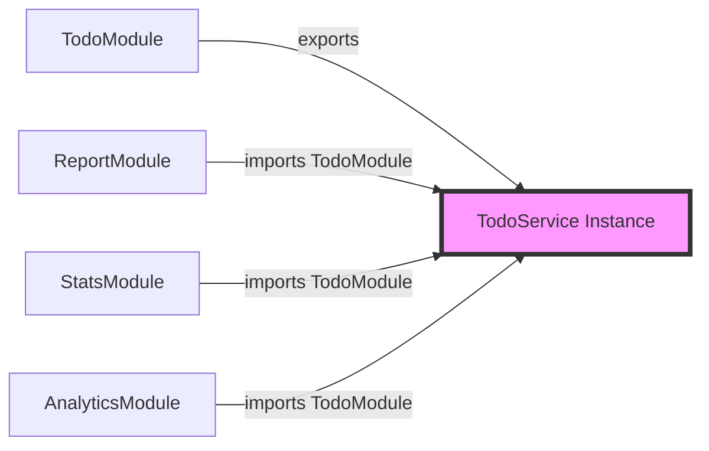

# NestJS Module 系統深入解析

## 📝 前言

Module 是 NestJS 架構的核心，它將相關功能組織成獨立的單元，並透過模組間的依賴關係構建整個應用程式。每個 NestJS 應用都從一個**根模組 (Root Module)** 開始，以樹狀結構向外擴展。

> **🎯 學習目標**: 掌握 Module 的設計理念、建立方式、參數配置，以及不同類型模組的使用場景。

## 🏗️ Module 的核心概念

### 什麼是「把相同性質的功能包裝在一起」？

想像一個國際美食街的架構：

```text
🏪 國際美食街
├── 🇹🇼 臺灣美食區
│   ├── 滷肉飯
│   ├── 珍珠奶茶
│   └── 小籠包
├── 🇯🇵 日式料理區
│   ├── 壽司
│   ├── 拉麵
│   └── 天婦羅
└── 🇺🇸 美式風味區
    ├── 漢堡
    ├── 披薩
    └── 炸雞
```

每個美食區都有其專屬的菜單和服務，顧客不會在臺灣美食區點到日式拉麵。同樣地，在 NestJS 中：

```typescript
// ❌ 錯誤示範：混淆模組職責
@Module({
  // UserModule 不應該處理 Todo 相關邏輯
})

// ✅ 正確示範：各司其職
@Module({
  // TodoModule：處理待辦事項
  // UserModule：處理使用者資料
  // AuthModule：處理身份驗證
})
```

### 什麼是「依照各模組的需求來串接」？

Module 不一定要包含 Controller，它可以是純功能性的模組。以餐廳餐具為例：

| 餐具類型 | 臺灣美食區 | 日式料理區 | 美式風味區 |
|---------|-----------|-----------|----------|
| 🥢 筷子 | ✅ 使用 | ✅ 使用 | ❌ 不使用 |
| 🍴 刀叉 | ❌ 不使用 | ⚠️ 偶爾 | ✅ 使用 |
| 🥄 湯匙 | ✅ 使用 | ✅ 使用 | ✅ 使用 |

> **💡 概念**: 「筷子」可視為共享模組，在需要的區域（模組）間共用，而不是強制所有區域都使用。

## 🛠️ 建置 Module

### 使用 NestJS CLI 建立模組

所有的 Module 都必須使用 `@Module` 裝飾器來定義。最快速的方式是使用 NestJS CLI：

```bash
# 基本語法
$ nest generate module <MODULE_NAME>

# 簡寫語法
$ nest g mo <MODULE_NAME>

# 建立含路徑的模組
$ nest g mo features/todo
```

> **💡 提示**: `<MODULE_NAME>` 可以包含路徑，如 `features/todo`，這樣會在 src 資料夾下建立對應的目錄結構。

### 生成的檔案結構

執行 `nest g mo features/todo` 後，會產生以下結構：

```text
src/
└── features/
    └── todo/
        └── todo.module.ts  # Module 定義檔
```

### 基本 Module 結構

```typescript
import { Module } from '@nestjs/common';

@Module({})
export class TodoModule {}
```

## 📦 Module 參數詳解

`@Module` 裝飾器接受一個配置物件，包含四個主要參數：

### 🎨 參數對照表

| 參數 | 用途 | 範例 | 說明 |
|------|------|------|------|
| **controllers** | 註冊控制器 | `[TodoController]` | 定義此模組的 HTTP 端點 |
| **providers** | 註冊提供者 | `[TodoService]` | 可注入的類別（Service、Repository 等） |
| **imports** | 匯入模組 | `[DatabaseModule]` | 使用其他模組的功能 |
| **exports** | 匯出提供者 | `[TodoService]` | 供其他模組使用的提供者 |

### 完整配置範例

```typescript
import { Module } from '@nestjs/common';
import { TodoController } from './todo.controller';
import { TodoService } from './todo.service';
import { DatabaseModule } from '../database/database.module';

@Module({
  imports: [DatabaseModule],        // 匯入其他模組
  controllers: [TodoController],    // 註冊控制器
  providers: [TodoService],         // 註冊服務
  exports: [TodoService]            // 匯出服務供其他模組使用
})
export class TodoModule {}
```

> **⚠️ 注意**: Provider 的詳細概念會在後續章節深入探討。

## 🎯 功能模組 (Feature Module)

功能模組是最常見的模組類型，將相關的業務邏輯封裝在一起。

### 建立完整的功能模組

#### Step 1: 建立 Controller

```bash
# 建立 Controller
$ nest g co features/todo
```

NestJS CLI 會自動將 Controller 註冊到對應的 Module：

```typescript
import { Module } from '@nestjs/common';
import { TodoController } from './todo.controller';

@Module({
  controllers: [TodoController]  // 自動註冊
})
export class TodoModule {}
```

#### Step 2: 建立 Service

```bash
# 建立 Service
$ nest g s features/todo
```

Service 也會自動註冊到 providers：

```typescript
import { Module } from '@nestjs/common';
import { TodoController } from './todo.controller';
import { TodoService } from './todo.service';

@Module({
  controllers: [TodoController],
  providers: [TodoService]  // 自動註冊
})
export class TodoModule {}
```
### 實作範例：Todo 功能模組

#### Service 實作

```typescript
// todo.service.ts
import { Injectable } from '@nestjs/common';

// 定義 Todo 介面
interface Todo {
  id: number;
  title: string;
  description: string;
  completed?: boolean;
}

@Injectable()
export class TodoService {
  // 模擬資料庫
  private todos: Todo[] = [
    {
      id: 1,
      title: 'Learn NestJS',
      description: 'Study Module system',
      completed: false
    }
  ];

  // 取得所有待辦事項
  getTodos(): Todo[] {
    return this.todos;
  }

  // 建立待辦事項
  createTodo(todo: Omit<Todo, 'id'>): Todo {
    const newTodo = {
      id: this.todos.length + 1,
      ...todo
    };
    this.todos.push(newTodo);
    return newTodo;
  }
}
```

#### Controller 實作

```typescript
// todo.controller.ts
import { Controller, Get, Post, Body } from '@nestjs/common';
import { TodoService } from './todo.service';

@Controller('todos')
export class TodoController {
  // 依賴注入 TodoService
  constructor(
    private readonly todoService: TodoService
  ) {}

  @Get()
  getAll() {
    return this.todoService.getTodos();
  }

  @Post()
  create(@Body() createTodoDto: any) {
    return this.todoService.createTodo(createTodoDto);
  }
}
```

> **✨ 重點**: NestJS CLI 會自動將新建的 Module 註冊到 AppModule，無需手動設定！

### 測試功能模組

啟動應用程式後，訪問 `http://localhost:3000/todos`：

```json
[
  {
    "id": 1,
    "title": "Learn NestJS",
    "description": "Study Module system",
    "completed": false
  }
]
```

## 🔄 共享模組 (Shared Module)

### 核心概念

NestJS 中的 Module 預設都是**單例模式 (Singleton)**，可以在多個模組間共享同一個實例。這確保了：

- 📊 **資源效率**: 避免重複建立實例
- 🔒 **狀態一致**: 所有模組使用相同的資料
- ♻️ **高度重用**: 模組可被多處引用

### 建立共享模組

#### Step 1: 匯出 Service

```typescript
// todo.module.ts
import { Module } from '@nestjs/common';
import { TodoController } from './todo.controller';
import { TodoService } from './todo.service';

@Module({
  controllers: [TodoController],
  providers: [TodoService],
  exports: [TodoService]  // 👈 關鍵：匯出 Service
})
export class TodoModule {}
```

#### Step 2: 建立使用共享服務的模組

```bash
# 建立新模組和控制器
$ nest g mo features/report
$ nest g co features/report
```

#### Step 3: 匯入共享模組

```typescript
// report.module.ts
import { Module } from '@nestjs/common';
import { TodoModule } from '../todo/todo.module';
import { ReportController } from './report.controller';

@Module({
  imports: [TodoModule],  // 👈 匯入 TodoModule
  controllers: [ReportController]
})
export class ReportModule {}
```

#### Step 4: 使用共享的 Service

```typescript
// report.controller.ts
import { Controller, Get } from '@nestjs/common';
import { TodoService } from '../todo/todo.service';

@Controller('report')
export class ReportController {
  constructor(
    private readonly todoService: TodoService  // 👈 注入共享的 TodoService
  ) {}

  @Get('todo-stats')
  getTodoStats() {
    const todos = this.todoService.getTodos();
    return {
      total: todos.length,
      completed: todos.filter(t => t.completed).length,
      pending: todos.filter(t => !t.completed).length,
      generatedAt: new Date()
    };
  }
}
```

### 🔍 共享模組的運作原理



> **💡 重點**: 所有匯入 TodoModule 的模組都會共享**同一個** TodoService 實例，確保資料一致性。

### 實際驗證共享機制

```typescript
// 在 ReportController 中新增一個 Todo
@Post('add-from-report')
addTodo(@Body() todo: any) {
  return this.todoService.createTodo(todo);
}

// 在 TodoController 中查看
@Get()
getAll() {
  return this.todoService.getTodos();
  // 會看到從 ReportController 新增的 Todo
}
```

## 🌍 全域模組 (Global Module)

### 使用場景

當某個模組需要被**大量模組**使用時，可以將其設為全域模組：

| 適合全域的模組 | 原因 |
|---------------|------|
| 🔧 ConfigModule | 應用程式配置到處需要 |
| 🗄️ DatabaseModule | 資料庫連線全域共用 |
| 📊 LoggerModule | 日誌記錄無處不在 |
| 🔐 CacheModule | 快取服務廣泛使用 |

### 建立全域模組

```typescript
import { Module, Global } from '@nestjs/common';
import { ConfigService } from './config.service';

@Global()  // 👈 設為全域模組
@Module({
  providers: [ConfigService],
  exports: [ConfigService]
})
export class ConfigModule {}
```

### 使用全域模組

```typescript
// user.module.ts - 不需要 imports ConfigModule
@Module({
  controllers: [UserController]
})
export class UserModule {}

// user.controller.ts - 可直接注入 ConfigService
@Controller('users')
export class UserController {
  constructor(
    private configService: ConfigService  // ✅ 可直接使用
  ) {}
}
```

### ⚠️ 使用原則

```typescript
// ❌ 不良實踐：濫用全域模組
@Global()
@Module({
  // TodoModule 不應該是全域的
})
export class TodoModule {}

// ✅ 良好實踐：只將基礎設施模組設為全域
@Global()
@Module({
  // 資料庫、配置、日誌等基礎服務
})
export class CoreModule {}
```

> **⚠️ 警告**: 過度使用全域模組會破壞模組的封裝性，降低程式碼的可維護性。

## 📚 常用模組 (Common Module)

### 設計模式

常用模組是一種**聚合模式**，將多個相關模組組合在一起，簡化匯入流程：

```typescript
// common.module.ts
import { Module } from '@nestjs/common';
import { HttpModule } from '@nestjs/axios';
import { ConfigModule } from '@nestjs/config';
import { CacheModule } from '@nestjs/cache-manager';

@Module({
  imports: [
    HttpModule,
    ConfigModule,
    CacheModule
  ],
  exports: [
    HttpModule,
    ConfigModule,
    CacheModule
  ],
})
export class CommonModule {}
```

### 使用優勢

```typescript
// ❌ 沒有 CommonModule：需要多次匯入
@Module({
  imports: [
    HttpModule,
    ConfigModule,
    CacheModule,
    // ... 其他模組
  ]
})

// ✅ 使用 CommonModule：一次匯入
@Module({
  imports: [CommonModule]
})
```

### 🎓 前端工程師視角

如果你熟悉前端框架，可以這樣理解 NestJS 的模組系統：

| NestJS Module | 前端類比 | 說明 |
|---------------|----------|------|
| **Feature Module** | Vue/React Component | 封裝特定功能 |
| **Shared Module** | Shared Components | 可重用的元件 |
| **Global Module** | Global State (Vuex/Redux) | 全域可存取 |
| **Common Module** | UI Library (Element/Ant Design) | 常用功能集合 |

## 📊 模組類型比較

| 模組類型 | 使用場景 | 匯入方式 | 範例 |
|---------|---------|---------|------|
| **功能模組** | 業務邏輯 | 需要明確匯入 | UserModule, OrderModule |
| **共享模組** | 跨模組共享 | 匯入後可用其服務 | EmailModule, PaymentModule |
| **全域模組** | 基礎設施 | 自動全域可用 | ConfigModule, LoggerModule |
| **常用模組** | 功能聚合 | 一次匯入多個 | CommonModule, SharedModule |

## 📋 本章重點總結

### 🎯 核心概念

- ✅ **模組封裝**: 將相關功能組織在一起
- ✅ **依賴注入**: 透過模組系統管理依賴關係
- ✅ **單例模式**: 模組預設為單例，確保實例唯一
- ✅ **模組通訊**: 透過 imports/exports 實現模組間通訊

### 🛠️ 技術要點

- ✅ **@Module 裝飾器**: controllers、providers、imports、exports
- ✅ **@Global 裝飾器**: 建立全域可用的模組
- ✅ **NestJS CLI**: 自動化模組建立和註冊
- ✅ **模組層級**: 從根模組開始的樹狀結構

### 💡 最佳實踐

1. **保持模組單一職責**: 每個模組專注於特定功能領域
2. **謹慎使用全域模組**: 只將基礎設施相關模組設為全域
3. **善用模組匯出**: 明確定義公開 API
4. **建立常用模組**: 減少重複匯入，提高開發效率

### 🔄 下一步學習

Module 系統是 NestJS 的基礎，接下來將學習：

- 🔜 **Provider 與依賴注入**: 深入了解 NestJS 的核心機制
- 🔜 **Service 層設計**: 業務邏輯的組織方式
- 🔜 **動態模組**: 根據配置動態建立模組
- 🔜 **模組作用域**: Request-scoped 和 Transient providers

---

> **💡 學習建議**: Module 是 NestJS 架構的骨幹，建議實際建立不同類型的模組，體驗模組間的依賴關係和資料共享機制！
